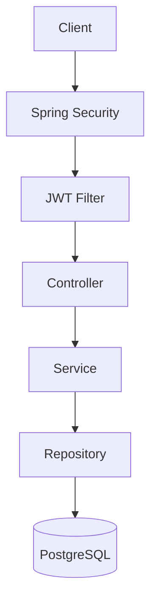

[🇪🇸 Español](README.md) | **🇬🇧 English**

# Secure Task API

A REST API for managing users and tasks, built with **Java 21** and **Spring Boot 3**. The project focuses on backend best practices: stateless **JWT** authentication, authorization by **role** and by **resource owner**, persistence with **PostgreSQL** and **Flyway**, validation, consistent error handling, tests with **Testcontainers** and deployment with **Docker**.


---

## Contents

- [Features](#features)
- [Tech stack](#tech-stack)
- [Architecture](#architecture)
- [Requirements](#requirements)
- [Configuration](#configuration)
- [Running](#running)
- [Trying the API with Swagger UI](#trying-the-api-with-swagger-ui)
- [JWT authentication](#jwt-authentication)
- [Roles and authorization](#roles-and-authorization)
- [Endpoints](#endpoints)
- [Examples](#examples)
- [Error format](#error-format)
- [Tests](#tests)
- [Security decisions](#security-decisions)
- [Future improvements](#future-improvements)
- [Author](#author)
- [License](#license)

---

## Features

- Sign-up and login with a **JWT access token** (HS256).
- Passwords stored with **BCrypt**; they never appear in responses or logs.
- **Stateless** API (`SessionCreationPolicy.STATELESS`), with no HTTP sessions.
- `USER` and `ADMIN` roles, with **vertical** (role) and **horizontal** (owner) access control.
- Task CRUD restricted to the user's own tasks.
- Admin panel: list, view, disable, enable and delete users, and view every task.
- Instant lockout: the token of a disabled or deleted user stops working immediately.
- Bean Validation with structured per-field errors.
- Global error handling with a single format and no stack traces.
- Versioned schema with **Flyway** (`ddl-auto=validate`).
- Pagination on every listing.
- Interactive documentation with **Swagger UI** and Bearer authentication.
- Optional creation of the initial administrator through environment variables.
- Unit, integration and security tests (62 tests).

## Tech stack

| Area | Technology |
|---|---|
| Language | Java 21 |
| Framework | Spring Boot 3.5 (Web, Validation, Security, Data JPA) |
| Security | Spring Security 6, JJWT 0.12, BCrypt |
| Persistence | Hibernate, PostgreSQL 16, Flyway |
| Documentation | springdoc-openapi (Swagger UI) |
| Testing | JUnit 5, Mockito, AssertJ, MockMvc, Testcontainers |
| Build and deployment | Maven (wrapper), Docker, Docker Compose |

Lombok is not used: DTOs are immutable `record`s and entities expose only the methods they need, so Lombok would add no value.

## Architecture

The application is organized **by feature** (auth, user, task) and, within each module, by layer. The flow is `Controller → Service → Repository → Database`.



```text
src/main/java/com/example/secureapi/
├── config/        # OpenAPI, Clock, administrator seed
├── security/      # SecurityConfig, JWT filter, JwtService, 401/403 handlers
├── auth/          # Sign-up and login
│   ├── controller/
│   ├── service/
│   └── dto/
├── user/          # Own profile and user administration
│   ├── controller/
│   ├── service/
│   ├── repository/
│   ├── entity/
│   └── dto/
├── task/          # Task CRUD and admin listing
│   ├── controller/
│   ├── service/
│   ├── repository/
│   ├── entity/
│   └── dto/
├── exception/     # Domain exceptions and GlobalExceptionHandler
└── common/        # ApiError, pagination, password policy
```

Principles applied:

- **DTOs** for every input and output; JPA entities never leave the service layer.
- **Constructor injection** in every component.
- **Immutability**: DTOs as `record`s and an immutable `UserPrincipal`, decoupled from the entity.
- **Entities with behavior** (`rename`, `disable`, `update`…) instead of generic setters.
- `open-in-view: false`: data access is confined to the service layer and its transactions.

## Requirements

- **Docker** and **Docker Compose** to run with containers.
- **Java 21** to run locally. Maven is not needed because the wrapper (`./mvnw`) is included.
- Docker is also required for the integration tests (Testcontainers).

## Configuration

All sensitive configuration is read from environment variables; there are no credentials in the code. Copy the template and fill it in:

```bash
cp .env.example .env
```

| Variable | Required | Description | Default |
|---|---|---|---|
| `DB_HOST` | No | PostgreSQL host | `localhost` |
| `DB_PORT` | No | PostgreSQL port | `5432` |
| `DB_NAME` | No | Database name | `secure_task_api` |
| `DB_USERNAME` | **Yes** | Database user | — |
| `DB_PASSWORD` | **Yes** | Database password | — |
| `JWT_SECRET` | **Yes** | HMAC key of at least 32 bytes | — |
| `JWT_EXPIRATION` | No | Token lifetime in seconds | `3600` |
| `ADMIN_EMAIL` | No | Initial administrator email | — |
| `ADMIN_PASSWORD` | No | Initial administrator password | — |
| `ADMIN_NAME` | No | Initial administrator name | `Administrator` |
| `APP_PORT` | No | Port published by Docker Compose | `8080` |

To generate a secure `JWT_SECRET`:

```bash
openssl rand -base64 48
```

The application **does not start** if `JWT_SECRET` is shorter than 32 bytes.

## Running

### With Docker (recommended)

```bash
cp .env.example .env   # and edit the values
docker compose up --build
```

- API: http://localhost:8080
- Swagger UI: http://localhost:8080/swagger-ui.html
- OpenAPI JSON: http://localhost:8080/v3/api-docs

Compose starts PostgreSQL with a healthcheck, waits until it is available and then starts the API, which applies the Flyway migrations on startup.

### Locally

1. Start only PostgreSQL:

   ```bash
   docker compose up -d postgres
   ```

2. Export the variables and start the application:

   ```bash
   export DB_USERNAME=secure_task_api DB_PASSWORD=change-me JWT_SECRET="$(openssl rand -base64 48)"
   ./mvnw spring-boot:run
   ```

   On Windows (PowerShell):

   ```powershell
   $env:DB_USERNAME="secure_task_api"; $env:DB_PASSWORD="change-me"; $env:JWT_SECRET="<32+ byte secret>"
   .\mvnw.cmd spring-boot:run
   ```

## Trying the API with Swagger UI

The project includes a **Swagger UI** interface to try every endpoint from the browser, without Postman or curl. Swagger is not published on the internet: it is served by **your own instance** of the API. Anyone who clones the repository and runs it (with Docker or locally) gets it on their machine.

### 1. Start the application with an administrator

```bash
git clone https://github.com/samsenpro/secure-task-api.git
cd secure-task-api
cp .env.example .env
```

Edit `.env` and set at least `DB_PASSWORD`, `JWT_SECRET`, `ADMIN_EMAIL` and `ADMIN_PASSWORD`. The administrator password must meet the password policy; if it doesn't, the administrator is not created and a warning is logged. Example:

```dotenv
DB_PASSWORD=a-local-password
JWT_SECRET=paste-the-output-of-openssl-rand-base64-48-here
ADMIN_EMAIL=admin@demo.local
ADMIN_PASSWORD=AdminDemo123
```

```bash
docker compose up --build
```

When `Started SecureTaskApiApplication` appears in the log, open **http://localhost:8080/swagger-ui.html**.

### 2. Create a user and log in

1. Expand **Authentication → `POST /api/v1/auth/register`**, click **Try it out** and then **Execute**. The example body is already filled in (`user@example.com` / `Password123!`). Expected response: **201 Created**.
2. Expand **`POST /api/v1/auth/login`**, click **Try it out** and **Execute** with the same credentials. Expected response: **200 OK** with an `accessToken`.
3. Copy the `accessToken` value, without the quotes.

### 3. Authorize Swagger with the token

1. Click the **Authorize** 🔓 button at the top.
2. Paste the token in the **Value** field. There's no need to type `Bearer`: Swagger adds it automatically.
3. Click **Authorize** and then **Close**. From then on, every request includes `Authorization: Bearer <token>`.

### 4. Try the tasks

| Step | Endpoint | What to send | Expected result |
|---|---|---|---|
| Create | `POST /api/v1/tasks` | `{"title": "My task", "priority": "HIGH"}` | `201` with the task in `PENDING` state |
| List | `GET /api/v1/tasks` | `page=0`, `size=20` | `200` with the paginated list of **your** tasks |
| View | `GET /api/v1/tasks/{id}` | the `id` returned on creation | `200` |
| Edit | `PUT /api/v1/tasks/{id}` | `{"title": "Edited", "status": "COMPLETED", "priority": "LOW"}` | `200` with the changes |
| Delete | `DELETE /api/v1/tasks/{id}` | the `id` | `204 No Content` |

### 5. Check the security

| Test | How | Expected result |
|---|---|---|
| No token | Click **Authorize → Logout** and call `GET /api/v1/tasks` | `401 Unauthorized` |
| Insufficient role | Authorized as `USER`, call `GET /api/v1/admin/users` | `403 Forbidden` |
| Someone else's task | Register a second user, authorize with their token and request `GET /api/v1/tasks/{id}` for a task of the first user | `404 Not Found` |
| Invalid data | `POST /api/v1/auth/register` with `{"name": "", "email": "x", "password": "weak"}` | `400` with per-field errors |
| Duplicate email | Register `user@example.com` again | `409 Conflict` |

### 6. Try it as an administrator

1. Click **Authorize → Logout**.
2. Log in with `ADMIN_EMAIL` / `ADMIN_PASSWORD` and authorize Swagger with the new token.
3. Try the **Admin - Users** and **Admin - Tasks** endpoints:
   - `GET /api/v1/admin/users` → list of every user.
   - `PATCH /api/v1/admin/users/{id}/disable` → disables a user. Their token stops working immediately (`401`) and they can't log in again either.
   - `PATCH /api/v1/admin/users/{id}/enable` → enables them again.
   - `DELETE /api/v1/admin/users/{id}` → deletes them together with their tasks (`204`).
   - `GET /api/v1/admin/tasks` → tasks of every user.

> The token expires after `JWT_EXPIRATION` seconds (1 hour by default). If you start getting `401`, log in again and re-authorize Swagger.

### Shutting down

```bash
docker compose down        # stops the containers and keeps the data
docker compose down -v     # stops the containers and also deletes the database
```

## JWT authentication

1. The client signs up (`POST /api/v1/auth/register`) and logs in (`POST /api/v1/auth/login`).
2. Login returns an **access token** signed with HS256. The token includes `sub` (email), `role`, `iss`, `iat` and `exp`.
3. Every protected request sends the header:

   ```http
   Authorization: Bearer <token>
   ```

4. `JwtAuthenticationFilter` extracts the token from the header, validates the signature, issuer and expiration, gets the email, loads the user from the database and sets the `SecurityContext`.
5. If the token is missing, invalid or expired, or the user no longer exists or is disabled, the request continues unauthenticated and Spring Security responds **401**.

In Swagger UI, click **Authorize** and paste the token (without the `Bearer` prefix).

## Roles and authorization

| Role | Permissions |
|---|---|
| `USER` | Manage their profile and **only their own** tasks. |
| `ADMIN` | All of the above, plus the `/api/v1/admin/**` endpoints: view, disable, enable and delete users, and view any task. |

- **Vertical authorization**: `/api/v1/admin/**` requires `ROLE_ADMIN` in the security configuration and, as defense in depth, also with `@PreAuthorize` on the controllers.
- **Horizontal authorization**: the owner id **always** comes from the authenticated token, never from the request. Queries filter by `id` **and** `user_id` together (`findByIdAndUserId`). If a user tries to access someone else's task they get **404**, as if it didn't exist, so as not to reveal which ids belong to other users.
- An administrator can't disable or delete themselves (**422**).
- Every registered user gets the `USER` role. `ADMIN` is only created through the seed.

## Endpoints

### Authentication (public)

| Method | Route | Description | Response |
|---|---|---|---|
| POST | `/api/v1/auth/register` | Register a user | `201` `UserResponse` |
| POST | `/api/v1/auth/login` | Log in | `200` `AuthResponse` |

### User (authenticated)

| Method | Route | Description | Response |
|---|---|---|---|
| GET | `/api/v1/users/me` | Get your own profile | `200` |
| PUT | `/api/v1/users/me` | Update the name and, optionally, the password | `200` |

### Tasks (authenticated, own tasks only)

| Method | Route | Description | Response |
|---|---|---|---|
| POST | `/api/v1/tasks` | Create a task | `201` + `Location` |
| GET | `/api/v1/tasks?page=0&size=20` | List your own tasks | `200` paginated |
| GET | `/api/v1/tasks/{id}` | Get a task | `200` / `404` |
| PUT | `/api/v1/tasks/{id}` | Replace a task | `200` / `404` |
| DELETE | `/api/v1/tasks/{id}` | Delete a task | `204` / `404` |

### Admin (`ROLE_ADMIN`)

| Method | Route | Description | Response |
|---|---|---|---|
| GET | `/api/v1/admin/users?page=0&size=20` | List users | `200` paginated |
| GET | `/api/v1/admin/users/{id}` | Get a user | `200` / `404` |
| PATCH | `/api/v1/admin/users/{id}/enable` | Enable a user | `200` |
| PATCH | `/api/v1/admin/users/{id}/disable` | Disable a user | `200` / `422` |
| DELETE | `/api/v1/admin/users/{id}` | Delete a user and their tasks | `204` / `422` |
| GET | `/api/v1/admin/tasks?page=0&size=20` | List every task | `200` paginated |

Listings are sorted from newest to oldest; `size` accepts values from 1 to 100.

## Examples

### Sign-up

```http
POST /api/v1/auth/register
Content-Type: application/json

{
  "name": "Jane Doe",
  "email": "user@example.com",
  "password": "Password123!"
}
```

```json
{
  "id": 2,
  "name": "Jane Doe",
  "email": "user@example.com",
  "role": "USER",
  "enabled": true,
  "createdAt": "2026-09-22T20:00:00Z",
  "updatedAt": "2026-09-22T20:00:00Z"
}
```

Password rules: at least 8 characters, with at least one uppercase letter, one lowercase letter and one number (72 at most, the BCrypt limit).

### Login

```http
POST /api/v1/auth/login
Content-Type: application/json

{
  "email": "user@example.com",
  "password": "Password123!"
}
```

```json
{
  "accessToken": "eyJhbGciOiJIUzI1NiJ9...",
  "tokenType": "Bearer",
  "expiresIn": 3600
}
```

### Create a task

```http
POST /api/v1/tasks
Authorization: Bearer <token>
Content-Type: application/json

{
  "title": "Prepare the demo",
  "description": "Review the endpoints before the meeting",
  "priority": "HIGH"
}
```

```json
{
  "id": 1,
  "title": "Prepare the demo",
  "description": "Review the endpoints before the meeting",
  "status": "PENDING",
  "priority": "HIGH",
  "userId": 2,
  "createdAt": "2026-09-22T20:05:00Z",
  "updatedAt": "2026-09-22T20:05:00Z"
}
```

`priority` is optional (defaults to `MEDIUM`) and every new task starts as `PENDING`.

### Update a task

```http
PUT /api/v1/tasks/1
Authorization: Bearer <token>
Content-Type: application/json

{
  "title": "Prepare the demo",
  "description": "Endpoints reviewed",
  "status": "COMPLETED",
  "priority": "HIGH"
}
```

Valid values: `status` ∈ `PENDING`, `IN_PROGRESS`, `COMPLETED`; `priority` ∈ `LOW`, `MEDIUM`, `HIGH`.

### Paginated listing

```json
{
  "content": [ { "id": 1, "title": "Prepare the demo", "...": "..." } ],
  "page": 0,
  "size": 20,
  "totalElements": 1,
  "totalPages": 1
}
```

### Update the profile and change the password

```http
PUT /api/v1/users/me
Authorization: Bearer <token>
Content-Type: application/json

{
  "name": "Jane Smith",
  "currentPassword": "Password123!",
  "newPassword": "NewPassword456!"
}
```

`currentPassword` and `newPassword` are optional; if `newPassword` is sent, `currentPassword` is required. The email identifies the user in the token and cannot be changed.

## Error format

Every error response, including the 401 and 403 produced by the security filter chain, has the same format:

```json
{
  "timestamp": "2026-09-22T20:00:00Z",
  "status": 404,
  "error": "NOT_FOUND",
  "message": "Task not found",
  "path": "/api/v1/tasks/10"
}
```

Validation errors add per-field detail:

```json
{
  "timestamp": "2026-09-22T20:00:00Z",
  "status": 400,
  "error": "BAD_REQUEST",
  "message": "Validation failed",
  "path": "/api/v1/auth/register",
  "errors": [
    { "field": "email", "message": "must be a well-formed email address" },
    { "field": "password", "message": "must be at least 8 characters long and contain an uppercase letter, a lowercase letter and a number" }
  ]
}
```

| Code | When |
|---|---|
| `400` | Validation, malformed JSON, invalid parameters |
| `401` | Missing, invalid or expired token; wrong credentials |
| `403` | Authenticated user without the required role |
| `404` | Resource doesn't exist or belongs to another user |
| `409` | Email already registered |
| `422` | Business rule violated (wrong current password, admin self-lockout) |
| `500` | Unexpected error (logged on the server; the client never receives the stack trace) |

## Tests

```bash
./mvnw test
```

Docker must be running: the integration tests start a real PostgreSQL with Testcontainers.

| Type | Classes | What is tested |
|---|---|---|
| Unit (JUnit 5 + Mockito) | `AuthServiceTest`, `UserServiceTest`, `TaskServiceTest`, `JwtServiceTest` | Business rules, email normalization, hashing, generic login errors, task ownership, JWT signature, expiration, issuer and tampering |
| Integration (Testcontainers + MockMvc) | `AuthIntegrationTest`, `TaskIntegrationTest` | Sign-up, login, BCrypt in the DB, validation, 409, full task CRUD, pagination, profile |
| Security | `SecurityIntegrationTest` | No token → 401 · invalid or tampered token → 401 · `USER` on `/admin` → 403 · own task → 200 · someone else's task → 404 · `ADMIN` on `/admin` → 200 · disabled or deleted user → 401 · `userId` injected in the body is ignored |

## Security decisions

- **CSRF disabled, with justification**: the API is stateless and authenticates only with `Authorization: Bearer`. It doesn't use session cookies, so the browser never attaches credentials automatically and there's nothing a CSRF attack could exploit. The rationale is also documented in `SecurityConfig`.
- **No user enumeration on login**: an unknown email, a wrong password or a disabled account all return the same response (`401 Invalid email or password`). Sign-up does return `409` if the email already exists, as the API contract requires.
- **Other users' resources return 404** instead of 403 so as not to confirm they exist.
- **User reloaded on every request**: disabling or deleting an account invalidates its tokens immediately, without waiting for them to expire.
- **JWT key validated at startup** (≥ 32 bytes) and issuer (`iss`) required on validation.
- **Normalized emails** (lowercase, trimmed) to avoid duplicates such as `User@x.com` and `user@x.com`.
- **No free-form sorting in pagination**: the order is fixed on the server to avoid sorting by internal fields.
- **Logs without sensitive data**: passwords and tokens are never logged; DTO and entity `toString()` methods omit them.
- **Unprivileged container**: the final image runs as a non-root user on an Alpine JRE.
- **Security headers**: Spring Security defaults plus a Content-Security-Policy.

## Future improvements

- Refresh tokens with rotation and revocation (a revoked-token list or a per-user `tokenVersion`).
- Rate limiting and temporary lockout after several failed login attempts.
- Email verification and password recovery.
- Filters and search on task listings (status, priority, text).
- Audit trail of administrative actions.
- Spring Boot Actuator with health checks and metrics (Prometheus/Grafana).
- CI pipeline (GitHub Actions) with tests, static analysis and dependency scanning.
- Asymmetric keys (RS256) so other services can validate tokens without knowing the secret.

## Author

- **LinkedIn:** [samuel-martinez-beleno](https://www.linkedin.com/in/samuel-martinez-beleno/)
- **GitHub:** [samsenpro](https://github.com/samsenpro)

## License

Distributed under the [MIT](LICENSE) license.
