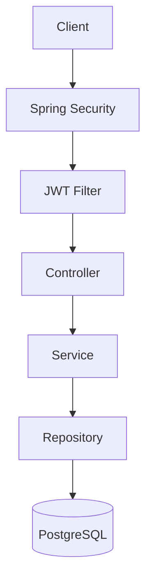

# Secure Task API

API REST para gestionar usuarios y tareas, construida con **Java 21** y **Spring Boot 3**. El proyecto se centra en las buenas prácticas de backend: autenticación **JWT** stateless, autorización por **roles** y por **propietario del recurso**, persistencia con **PostgreSQL** y **Flyway**, validación, manejo de errores consistente, tests con **Testcontainers** y despliegue con **Docker**.


---

## Índice

- [Características](#características)
- [Stack tecnológico](#stack-tecnológico)
- [Arquitectura](#arquitectura)
- [Requisitos](#requisitos)
- [Configuración](#configuración)
- [Ejecución](#ejecución)
- [Autenticación JWT](#autenticación-jwt)
- [Roles y autorización](#roles-y-autorización)
- [Endpoints](#endpoints)
- [Ejemplos](#ejemplos)
- [Formato de errores](#formato-de-errores)
- [Tests](#tests)
- [Decisiones de seguridad](#decisiones-de-seguridad)
- [Mejoras futuras](#mejoras-futuras)
- [Licencia](#licencia)

---

## Características

- Registro e inicio de sesión con **JWT access token** (HS256).
- Contraseñas almacenadas con **BCrypt**; nunca aparecen en respuestas ni en logs.
- API **stateless** (`SessionCreationPolicy.STATELESS`), sin sesiones HTTP.
- Roles `USER` y `ADMIN`, con control de acceso **vertical** (rol) y **horizontal** (propietario).
- CRUD de tareas limitado a las tareas propias.
- Panel de administración: listar, consultar, bloquear, desbloquear y eliminar usuarios, y ver todas las tareas.
- Bloqueo efectivo al instante: el token de un usuario bloqueado o eliminado deja de funcionar.
- Validación con Bean Validation y errores estructurados por campo.
- Manejo global de errores con un formato único y sin stack traces.
- Esquema versionado con **Flyway** (`ddl-auto=validate`).
- Paginación en todos los listados.
- Documentación interactiva con **Swagger UI** y autenticación Bearer.
- Creación opcional del administrador inicial mediante variables de entorno.
- Tests unitarios, de integración y de seguridad (62 tests).

## Stack tecnológico

| Área | Tecnología |
|---|---|
| Lenguaje | Java 21 |
| Framework | Spring Boot 3.5 (Web, Validation, Security, Data JPA) |
| Seguridad | Spring Security 6, JJWT 0.12, BCrypt |
| Persistencia | Hibernate, PostgreSQL 16, Flyway |
| Documentación | springdoc-openapi (Swagger UI) |
| Testing | JUnit 5, Mockito, AssertJ, MockMvc, Testcontainers |
| Build y despliegue | Maven (wrapper), Docker, Docker Compose |

No se usa Lombok: los DTOs son `record` inmutables y las entidades exponen solo los métodos que necesitan, así que Lombok no aportaría valor.

## Arquitectura

La aplicación está organizada **por funcionalidad** (auth, user, task) y, dentro de cada módulo, por capas. El flujo es `Controller → Service → Repository → Database`.



```text
src/main/java/com/example/secureapi/
├── config/        # OpenAPI, Clock, seed del administrador
├── security/      # SecurityConfig, filtro JWT, JwtService, handlers 401/403
├── auth/          # Registro y login
│   ├── controller/
│   ├── service/
│   └── dto/
├── user/          # Perfil propio y administración de usuarios
│   ├── controller/
│   ├── service/
│   ├── repository/
│   ├── entity/
│   └── dto/
├── task/          # CRUD de tareas y listado administrativo
│   ├── controller/
│   ├── service/
│   ├── repository/
│   ├── entity/
│   └── dto/
├── exception/     # Excepciones de dominio y GlobalExceptionHandler
└── common/        # ApiError, paginación, política de contraseñas
```

Principios aplicados:

- **DTOs** en todas las entradas y salidas; las entidades JPA nunca salen de la capa de servicio.
- **Inyección por constructor** en todos los componentes.
- **Inmutabilidad**: DTOs como `record` y un `UserPrincipal` inmutable, desacoplado de la entidad.
- **Entidades con comportamiento** (`rename`, `disable`, `update`…) en lugar de setters genéricos.
- `open-in-view: false`: el acceso a datos se limita a la capa de servicio y sus transacciones.

## Requisitos

- **Docker** y **Docker Compose** para la ejecución con contenedores.
- **Java 21** para la ejecución local. Maven no es necesario porque se incluye el wrapper (`./mvnw`).
- Docker también es necesario para los tests de integración (Testcontainers).

## Configuración

Toda la configuración sensible se lee de variables de entorno; no hay credenciales en el código. Copia la plantilla y rellénala:

```bash
cp .env.example .env
```

| Variable | Obligatoria | Descripción | Por defecto |
|---|---|---|---|
| `DB_HOST` | No | Host de PostgreSQL | `localhost` |
| `DB_PORT` | No | Puerto de PostgreSQL | `5432` |
| `DB_NAME` | No | Nombre de la base de datos | `secure_task_api` |
| `DB_USERNAME` | **Sí** | Usuario de la base de datos | — |
| `DB_PASSWORD` | **Sí** | Contraseña de la base de datos | — |
| `JWT_SECRET` | **Sí** | Clave HMAC de al menos 32 bytes | — |
| `JWT_EXPIRATION` | No | Validez del token en segundos | `3600` |
| `ADMIN_EMAIL` | No | Email del administrador inicial | — |
| `ADMIN_PASSWORD` | No | Contraseña del administrador inicial | — |
| `ADMIN_NAME` | No | Nombre del administrador inicial | `Administrator` |
| `APP_PORT` | No | Puerto publicado por Docker Compose | `8080` |

Para generar un `JWT_SECRET` seguro:

```bash
openssl rand -base64 48
```

La aplicación **no arranca** si `JWT_SECRET` tiene menos de 32 bytes.

## Ejecución

### Con Docker (recomendado)

```bash
cp .env.example .env   # y edita los valores
docker compose up --build
```

- API: http://localhost:8080
- Swagger UI: http://localhost:8080/swagger-ui.html
- OpenAPI JSON: http://localhost:8080/v3/api-docs

Compose levanta PostgreSQL con healthcheck, espera a que esté disponible y después arranca la API, que aplica las migraciones de Flyway al iniciar.

### En local

1. Levanta solo PostgreSQL:

   ```bash
   docker compose up -d postgres
   ```

2. Exporta las variables y arranca la aplicación:

   ```bash
   export DB_USERNAME=secure_task_api DB_PASSWORD=change-me JWT_SECRET="$(openssl rand -base64 48)"
   ./mvnw spring-boot:run
   ```

   En Windows (PowerShell):

   ```powershell
   $env:DB_USERNAME="secure_task_api"; $env:DB_PASSWORD="change-me"; $env:JWT_SECRET="<secreto de 32+ bytes>"
   .\mvnw.cmd spring-boot:run
   ```

## Autenticación JWT

1. El cliente se registra (`POST /api/v1/auth/register`) e inicia sesión (`POST /api/v1/auth/login`).
2. El login devuelve un **access token** firmado con HS256. El token incluye `sub` (email), `role`, `iss`, `iat` y `exp`.
3. Cada petición protegida envía el header:

   ```http
   Authorization: Bearer <token>
   ```

4. `JwtAuthenticationFilter` extrae el token del header, valida la firma, el emisor y la expiración, obtiene el email, carga el usuario desde la base de datos y establece el `SecurityContext`.
5. Si el token falta, no es válido, ha expirado, o el usuario ya no existe o está bloqueado, la petición continúa sin autenticar y Spring Security responde **401**.

En Swagger UI, pulsa **Authorize** y pega el token (sin el prefijo `Bearer`).

## Roles y autorización

| Rol | Permisos |
|---|---|
| `USER` | Gestionar su perfil y **solo sus propias** tareas. |
| `ADMIN` | Todo lo anterior, además de los endpoints `/api/v1/admin/**`: consultar, bloquear, desbloquear y eliminar usuarios, y consultar cualquier tarea. |

- **Autorización vertical**: `/api/v1/admin/**` exige `ROLE_ADMIN` en la configuración de seguridad y, como defensa en profundidad, también con `@PreAuthorize` en los controladores.
- **Autorización horizontal**: el id del propietario **siempre** sale del token autenticado, nunca de la petición. Las consultas filtran por `id` **y** `user_id` a la vez (`findByIdAndUserId`). Si un usuario intenta acceder a una tarea ajena recibe **404**, igual que si no existiera, para no revelar qué ids pertenecen a otros usuarios.
- Un administrador no puede bloquearse ni eliminarse a sí mismo (**422**).
- Todo usuario registrado recibe el rol `USER`. `ADMIN` solo se crea mediante el seed.

## Endpoints

### Authentication (públicos)

| Método | Ruta | Descripción | Respuesta |
|---|---|---|---|
| POST | `/api/v1/auth/register` | Registrar un usuario | `201` `UserResponse` |
| POST | `/api/v1/auth/login` | Iniciar sesión | `200` `AuthResponse` |

### User (autenticado)

| Método | Ruta | Descripción | Respuesta |
|---|---|---|---|
| GET | `/api/v1/users/me` | Obtener el perfil propio | `200` |
| PUT | `/api/v1/users/me` | Actualizar el nombre y, opcionalmente, la contraseña | `200` |

### Tasks (autenticado, solo tareas propias)

| Método | Ruta | Descripción | Respuesta |
|---|---|---|---|
| POST | `/api/v1/tasks` | Crear una tarea | `201` + `Location` |
| GET | `/api/v1/tasks?page=0&size=20` | Listar las tareas propias | `200` paginado |
| GET | `/api/v1/tasks/{id}` | Obtener una tarea | `200` / `404` |
| PUT | `/api/v1/tasks/{id}` | Reemplazar una tarea | `200` / `404` |
| DELETE | `/api/v1/tasks/{id}` | Eliminar una tarea | `204` / `404` |

### Admin (`ROLE_ADMIN`)

| Método | Ruta | Descripción | Respuesta |
|---|---|---|---|
| GET | `/api/v1/admin/users?page=0&size=20` | Listar usuarios | `200` paginado |
| GET | `/api/v1/admin/users/{id}` | Obtener un usuario | `200` / `404` |
| PATCH | `/api/v1/admin/users/{id}/enable` | Desbloquear un usuario | `200` |
| PATCH | `/api/v1/admin/users/{id}/disable` | Bloquear un usuario | `200` / `422` |
| DELETE | `/api/v1/admin/users/{id}` | Eliminar un usuario y sus tareas | `204` / `422` |
| GET | `/api/v1/admin/tasks?page=0&size=20` | Listar todas las tareas | `200` paginado |

Los listados están ordenados del más reciente al más antiguo; `size` admite valores de 1 a 100.

## Ejemplos

### Registro

```http
POST /api/v1/auth/register
Content-Type: application/json

{
  "name": "Jane Doe",
  "email": "user@example.com",
  "password": "Password123!"
}
```

```json
{
  "id": 2,
  "name": "Jane Doe",
  "email": "user@example.com",
  "role": "USER",
  "enabled": true,
  "createdAt": "2026-09-22T20:00:00Z",
  "updatedAt": "2026-09-22T20:00:00Z"
}
```

Reglas de la contraseña: mínimo 8 caracteres, al menos una mayúscula, una minúscula y un número (máximo 72, el límite de BCrypt).

### Login

```http
POST /api/v1/auth/login
Content-Type: application/json

{
  "email": "user@example.com",
  "password": "Password123!"
}
```

```json
{
  "accessToken": "eyJhbGciOiJIUzI1NiJ9...",
  "tokenType": "Bearer",
  "expiresIn": 3600
}
```

### Crear una tarea

```http
POST /api/v1/tasks
Authorization: Bearer <token>
Content-Type: application/json

{
  "title": "Preparar la demo",
  "description": "Revisar los endpoints antes de la reunión",
  "priority": "HIGH"
}
```

```json
{
  "id": 1,
  "title": "Preparar la demo",
  "description": "Revisar los endpoints antes de la reunión",
  "status": "PENDING",
  "priority": "HIGH",
  "userId": 2,
  "createdAt": "2026-09-22T20:05:00Z",
  "updatedAt": "2026-09-22T20:05:00Z"
}
```

`priority` es opcional (por defecto `MEDIUM`) y toda tarea nueva empieza en `PENDING`.

### Actualizar una tarea

```http
PUT /api/v1/tasks/1
Authorization: Bearer <token>
Content-Type: application/json

{
  "title": "Preparar la demo",
  "description": "Endpoints revisados",
  "status": "COMPLETED",
  "priority": "HIGH"
}
```

Valores válidos: `status` ∈ `PENDING`, `IN_PROGRESS`, `COMPLETED`; `priority` ∈ `LOW`, `MEDIUM`, `HIGH`.

### Listado paginado

```json
{
  "content": [ { "id": 1, "title": "Preparar la demo", "...": "..." } ],
  "page": 0,
  "size": 20,
  "totalElements": 1,
  "totalPages": 1
}
```

### Actualizar el perfil y cambiar la contraseña

```http
PUT /api/v1/users/me
Authorization: Bearer <token>
Content-Type: application/json

{
  "name": "Jane Smith",
  "currentPassword": "Password123!",
  "newPassword": "NewPassword456!"
}
```

`currentPassword` y `newPassword` son opcionales; si se envía `newPassword`, `currentPassword` es obligatoria. El email identifica al usuario en el token y no se puede modificar.

## Formato de errores

Todas las respuestas de error, incluidas las 401 y 403 que genera la cadena de filtros de seguridad, tienen el mismo formato:

```json
{
  "timestamp": "2026-09-22T20:00:00Z",
  "status": 404,
  "error": "NOT_FOUND",
  "message": "Task not found",
  "path": "/api/v1/tasks/10"
}
```

Los errores de validación añaden el detalle por campo:

```json
{
  "timestamp": "2026-09-22T20:00:00Z",
  "status": 400,
  "error": "BAD_REQUEST",
  "message": "Validation failed",
  "path": "/api/v1/auth/register",
  "errors": [
    { "field": "email", "message": "must be a well-formed email address" },
    { "field": "password", "message": "must be at least 8 characters long and contain an uppercase letter, a lowercase letter and a number" }
  ]
}
```

| Código | Cuándo |
|---|---|
| `400` | Validación, JSON mal formado, parámetros inválidos |
| `401` | Token ausente, inválido o expirado; credenciales incorrectas |
| `403` | Usuario autenticado sin el rol necesario |
| `404` | Recurso inexistente o que pertenece a otro usuario |
| `409` | Email ya registrado |
| `422` | Regla de negocio incumplida (contraseña actual incorrecta, autobloqueo del admin) |
| `500` | Error inesperado (se registra en el servidor; el cliente nunca recibe el stack trace) |

## Tests

```bash
./mvnw test
```

Docker debe estar en ejecución: los tests de integración levantan un PostgreSQL real con Testcontainers.

| Tipo | Clases | Qué se prueba |
|---|---|---|
| Unitarios (JUnit 5 + Mockito) | `AuthServiceTest`, `UserServiceTest`, `TaskServiceTest`, `JwtServiceTest` | Reglas de negocio, normalización del email, hashing, errores genéricos de login, propiedad de las tareas, firma, expiración, emisor y manipulación del JWT |
| Integración (Testcontainers + MockMvc) | `AuthIntegrationTest`, `TaskIntegrationTest` | Registro, login, BCrypt en la BD, validaciones, 409, CRUD completo de tareas, paginación, perfil |
| Seguridad | `SecurityIntegrationTest` | Sin token → 401 · token inválido o manipulado → 401 · `USER` en `/admin` → 403 · tarea propia → 200 · tarea ajena → 404 · `ADMIN` en `/admin` → 200 · usuario bloqueado o eliminado → 401 · `userId` inyectado en el body se ignora |

## Decisiones de seguridad

- **CSRF deshabilitado de forma justificada**: la API es stateless y se autentica solo con `Authorization: Bearer`. No usa cookies de sesión, así que el navegador no adjunta credenciales automáticamente y no hay nada que un ataque CSRF pueda aprovechar. La justificación también está documentada en `SecurityConfig`.
- **Sin enumeración de usuarios en el login**: un email inexistente, una contraseña incorrecta o una cuenta bloqueada devuelven la misma respuesta (`401 Invalid email or password`). El registro sí devuelve `409` si el email ya existe, como exige el contrato de la API.
- **Recursos ajenos devuelven 404** en lugar de 403 para no confirmar su existencia.
- **Usuario recargado en cada petición**: bloquear o eliminar una cuenta invalida sus tokens de inmediato, sin esperar a que expiren.
- **Clave JWT validada al arrancar** (≥ 32 bytes) y emisor (`iss`) obligatorio al validar.
- **Emails normalizados** (minúsculas y sin espacios) para evitar duplicados como `User@x.com` y `user@x.com`.
- **Sin orden libre en la paginación**: el orden se fija en el servidor para evitar ordenar por campos internos.
- **Logs sin datos sensibles**: nunca se registran contraseñas ni tokens; los `toString()` de los DTOs y entidades los omiten.
- **Contenedor sin privilegios**: la imagen final se ejecuta con un usuario no root sobre un JRE Alpine.
- **Cabeceras de seguridad** por defecto de Spring Security, además de una Content-Security-Policy.

## Mejoras futuras

- Refresh tokens con rotación y revocación (lista de tokens revocados o `tokenVersion` por usuario).
- Rate limiting y bloqueo temporal tras varios intentos de login fallidos.
- Verificación del email y recuperación de contraseña.
- Filtros y búsqueda en los listados de tareas (estado, prioridad, texto).
- Auditoría de acciones administrativas.
- Spring Boot Actuator con health checks y métricas (Prometheus/Grafana).
- Pipeline de CI (GitHub Actions) con tests, análisis estático y escaneo de dependencias.
- Claves asimétricas (RS256) para que otros servicios puedan validar tokens sin conocer el secreto.

## Licencia

Distribuido bajo la licencia [MIT](LICENSE).
